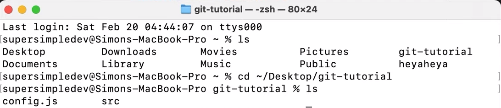
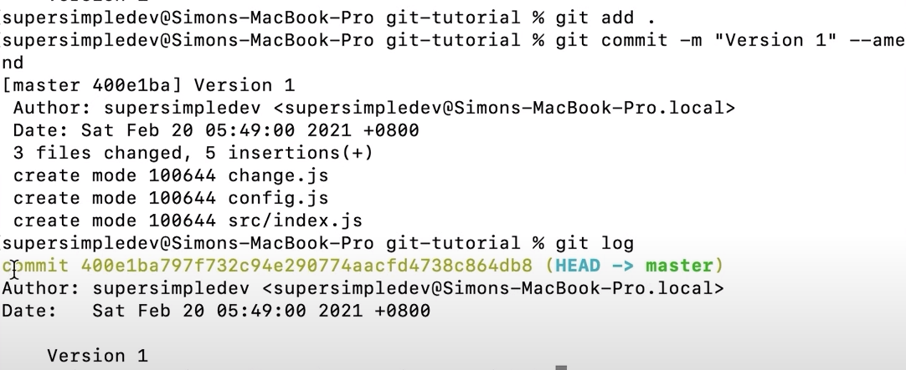

- It is advised to see the tutorial

- What is GIT?
    * It's a version history for our code
    * we can see a previous version or change to an older version

- How to install
    1. go to: git-scm.com/downloads
    2. pick your o.s:
        - Mac: 2:00 (in video):
            * install XCode:
                1. search and open terminal
                2. type "git"
                    - if you see this then git is installed:
                      
                    - else, if you see a popup like this then git is not installed: 
                      
                        * if this happens press install and it will download git for you.
                        * after installing, close the terminal and reopen it
                        * type git again and you should see the instructions
                    - if that also didn't work:
                        * go to the app store, search for xcode and install
                        * open xcode for the first time
                        * close and reopen the terminal
                        * type git again
        - Windows: 3:31 (in video):
            * downaloads automatically
            * can keep default options
            * go to "Windowa PowerShell"
            * type "git" and press the Enter key
            * 

- Project Setup:
    - Created the "2-project-setup" folder for demonstrating version history

- Git Setup:
    - open temainal:
        * Mac: search terminal in spotlight
        * Win: search powershell
    - side-note: cli / command line is a place in which we can run commands.
      such as "ls" to show the list of files and folders in the *current* folder.
      When we first open the cmd / cli, we are running commands in the $HOME folder.
      To change to the folder we want to run commands in, we'll use the command "cd" that will change the directory.
      One more thing is, after closing the commang line and reopening it, we return to the $HOME folder.
    - changing directory:
        * Mac: ex:
        
        * Win: cd [file directory]

- Creating a Version:
    1. setup git in the folder we want to work in:
        * open cli, cd to folder
        * run the "git init" command
        * ex: 
    2. run "git status" - it will show what changes have been made since the previous version. ex:
    
    It shows us that we have two files / folders (i.e. config.js and the folder src) that are not being tracked in our version history
    3. to create our first version:
        1. which changes we want?
            - git add
                * ex: git ass config.js → only add this file to the version
                * ex: git ass src → adds all files in the folder
                * ex: git ass . → adds all files in current directory
            - after running it, if we use the git status command again, we'll see: 
                
        2. commiting - creating a new version
            - Side note: version == commit, version history == commit history
            - git commit
                * ex: git commit -m "Version 1" → attaching a message to a commit (describe what was changed)
            - if you get this fatal error: 
                
                * git is requiring an email and name that will be attached to your commit message
                * To get passed this you need to run the two commands they show:
                    1. git config --global user.email "you@email.com"
                    2. git config --global user.name "Your Name"
                * ex:
                    - Windows: 
                    

- Viewing the History and Editing a Commit
    - Mac: 
    - configure:
        * git config --global user.email "you@email.com"
        * git config --global user.name "Your Name"
        * ex: 
    - log using: git log.

    - ex: while making commit you made a mistake. We want to add the file "change.js".
        * we'll simpy create our version as normal:
            1. git add .
            2. git commit -m "Version 1" --amend → changes are saved to previous commit
                
                * we now have 1 version in our version history
                * and we added a new file - "change.js"