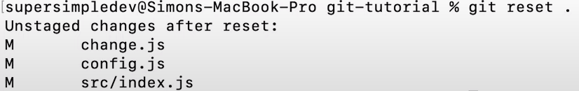

- Visualizing Git + Git Furmamenals
    * in the code editor: (vs code)
        - after changing files, you can go to the section with the branch symbol - 
        - click on any file and you'll see the changes you have from the previous version
        - this is the same as running the 'git status' command, but now we can visualize it all.
        - we can also run some git commands such as: 
            
            1. add by clicking the '+' sign instead of 'git add'
            2. 'git add .' == 
            3. Areas:
                - after adding the files, we see a *Staging Area*. These changes go to the next version → under the title of 'Staged Changes'
                - under the Staging Area we have the *Working Area*. These are changes that will **not** be in the next version
                - A file can be in both areas at once if we staged a change, then went and changed it again without staging. This is because git is tracking the changes and not the files themseleves. Once we're done, and the changed file is staged, the changes are automatically merged with what was originally there.
        - Taking changes out - Staging Area: 
            * instead of a '+' sign, we'll see a '-' sign.
            * in the terminal: 
                - git reset [name of specific file] → same as '-' on one file
                - git reset [name of specific folder] → same as '-' on one file
                - git reset . → un-stage all files. 
                    looks something like this: 
        - Resetting our working area:
            * git checkout -- [file name] → remove all changes in working area
            * git checkout -- . → remove all changes in working area
            * git checkout -- [] == click the back arrow on the file / folder as seen above
