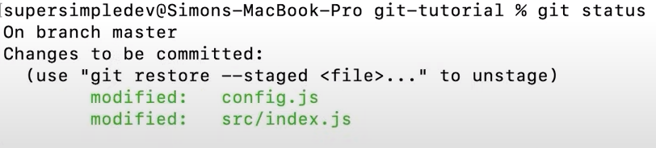

- Completing the Version History
    * after making a few changes we'll write in the terminal:
        1. git add .
        2. git commit -m "Version 2"
    * after making a few changes we'll write in the terminal:
        1. git add .
        2. git commit -m "Version 3"
    * use: git log → 
    * press "q" to close git log (if needed)

- Viewing Previous Versions of the Code:
    * creating versions is done manualy
    * viewing → git checkout [commit hash]. The commit hash is a long string of numbers and letters. 
    * ex: switching back to version 2: 
    * if we run git log, we'll see only 2 commits (up until our current commit, and not ahead of it)
    * to show all of the commit history, type: git log --all → something like this: 
    * now that we've changed the version we work on, we can see that the (HEAD) has moved to our current version. meaning, (HEAD) shows which version we are current;y using.
    * (we switched back to version 1 to continue the tutorial)

- Restoring Code to a Previous Version:
    * after updating the code, we'll run the 'git add .' and 'git commit -m "Version 1 upated" '
    * run git log --all, and we'll see → 

- Intro to Git Branching:
    * However, this branches in git. You can view the branching in the terminal like this:
        - git log --all --graph
        - we'll get this → 
    * We'll go back to the previous branch
    * master / main - branch name, always points to the latest commit in a branch.
    * using the branch name (instead of using the hash), we can switch to that branch like so: git checkout master
    * It would look something like this → 
    * now if we run: git log --all --graph, we'll get → 

- Restoring Code like in Google Docs:
    * git checkout [hash of commit] [files to restore] - this happens without changing the (HEAD)
    * ex: while in version 3, we can restore everything to be as it was in version 1 by running the command: git checkout [hash of version 1 commit] .
        - then we get something like this → 
    * we won't start branching like this
    * we'll run 'git status' and get → 
        - we can see that after using the checkout, all the files we've changed are automatically staged.
    * we'll run: git commit -m "Version 1 restored"
    * if we run: git log --all --graph, we'll see we don't have any branching