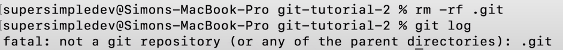

1. Create a Version:
    git init
    git status
    git add .
    git commit -m "Message"

2. View Previous Versions:
    git log --all --graph
    git checkout <commit_hash>
    git checkout <branch_name>

3. Restore to Previous Version:
    git checkout <hash|branch> <file|folder>
    git commit -m "Message"

- shortcuts:
    * git status → git s (alias)
    * git config --global alias.<alias_we_want_to_use> "<command>"
        - ex: git config --global alias.s "status"
    * git config --global alias.cm "commit -m" 
    * git config --global alias.co "checkout"

- ignoring files from going into your version history:
    * add a file called '.gitignore'
    * inside specify which files / folders you don't want to be loaded into a version

- completly removing Git from a project:
    * rm -rf .git → removes the .git folder and everything inside it
    * like this → 