- Feature 1 : Creating an Online Backup:
    * in Google drive → drag and drop
    * in GitHub → create new repository:
        1. click your profile and then click on 'your repositories'
        2. click 'new' and set-up your repository's settings
    * now we have 2 repository: on our computer [local repository], and the one on github [remote repository]
    * Upload local repo. into remote repo. ↓
        - open cli
        - change the directory that contains our code
        - add a link between the local and remote repos. ↓
            * git remote add [nickname for the remote repo - typically "origin"] [url of repo - make sure it starts with "https" and not "git"]
            * git remote -v → gives more details about the repos in github
            * to check: git remote → 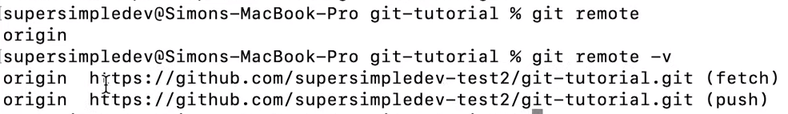
            * removing a repo: git remove [origin / name of repo]
            * uploading to github == push:
                1. git config --global credential.username "[username]"
                2. git push [where to - ex: origin] [branch we want to push - master / main - {can be checked by running the 'git log' command}]
                    * branch review:
                        - series of commits
                    * in 'git push' we push 1 branch of commits at a time
                3. You'll be asked for your github password:
                    - Mac: enter in the termianl
                    - Win: might get a popup in which you need to sign into your github account
                4. Troubleshooting if 'git push' didn't work:
                    - 5 things we can do:
                        1. Ensure you're using HTTPS url. Do this by running the 'git remote -v' command. If you don't see "https://..." then:
                            * go back to your github repo
                            * get your HTTPS link 
                            * run: git remote remove origin 
                            * then run: git remote add origin [https link]
                        2. Ensure you ran git config ( ↑ ).
                        3. Put your username in the remote url:
                            * run: git remote -v → you'll see the links
                            * run: git remote add origin [https://<username>@github.com/....]
                        4. Create a personal access token:
                            * go to your github, click your profile. Then go to 'Settings'
                            * go to 'Developer Settings'
                            * click 'Personal access tokens'
                            * click 'generate new token' then enter your password
                            * give your token a name & check your 'repo' checkbox
                            * click generate
                            * copy and save it someplace safe, you won't be able to find it again on github
                            * then in the terminal when you're asked to enter your password, enter your token instead
                        5. Set up SSH Keys → see the '3-notes-ssh-keys.md' file
            * downloading from github == pull

- Feature 2 : Sync Changes from Computer → GitHub:
    * First, we'll check to see if our local and remote repos are out of sync
        1. Go to the *root* of our GitHub repo. {root == the outer folder of your repo}
        2. Open cli, and run: git log --all --graph.
            - we'll see something like this → 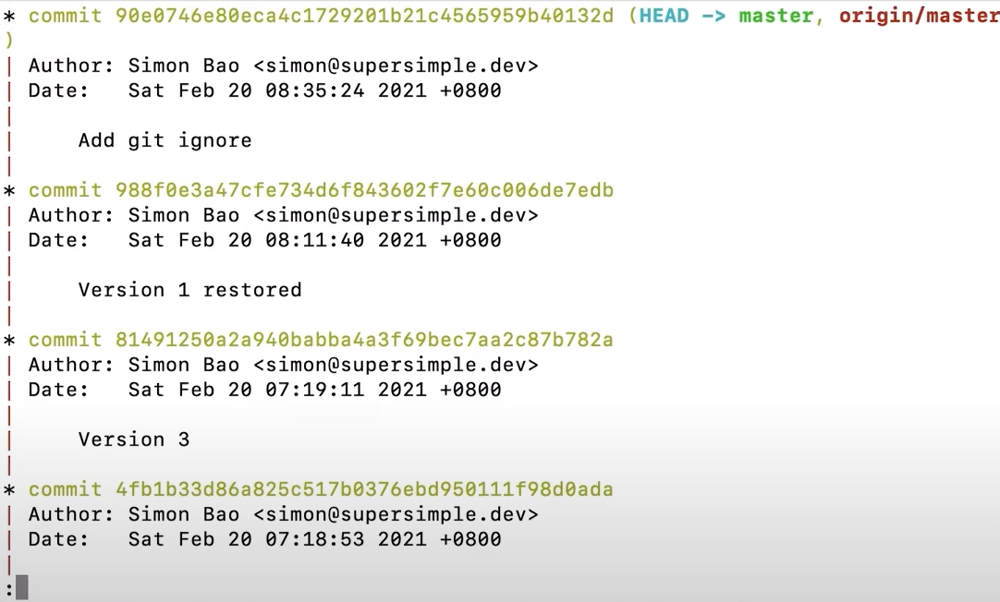
            - this is a remote tracking branch - it tells us what the main branch looks on origin
        3. Creating another commit: 
            - git add .
            - git commit -m "Version 11"
            - git log --all --graph
                * we'll see that → 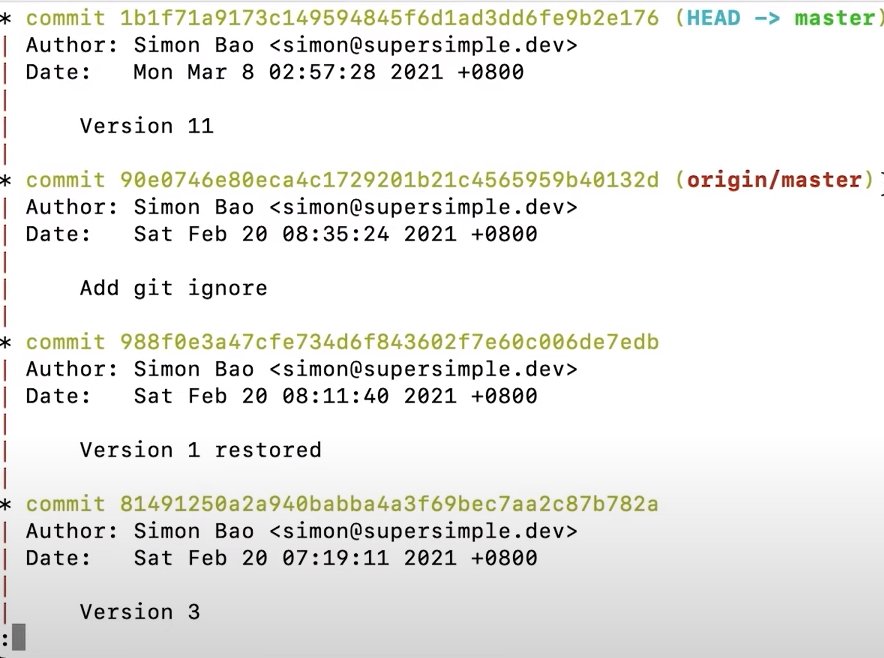
                * because we made a change in our local repo
            - Now we need to update our remote repo from our local repo:
                * run: git push origin master
                * git log --all --graph → shows all tags have moved back to the top of the screen (synced)
    * More About git push:
        - if we run: git push origin master, right now, we get the message that "Everything is up-to-date"
        - Shortcut: git push origin master --set-upstream 
            * Now everytime we write: git push, it will automatically execute: git push origin master
            * --set-upstram → Branch 'master' set up to track remote branch 'master' from 'origin'
        - pushing with no commits:
            * git status (after changing something, but not staging)
            * git push origin master → shows everything is up-to-date.
                - this is because 'git push' only pushes *commits*, not changes
                - same thing happens if we first execute a 'git add .' command
            * git push doesn't create a commit
        - changing previous commit:
            * git commit --amend -m "Version 12"
            * git log --all --graph → check version history → 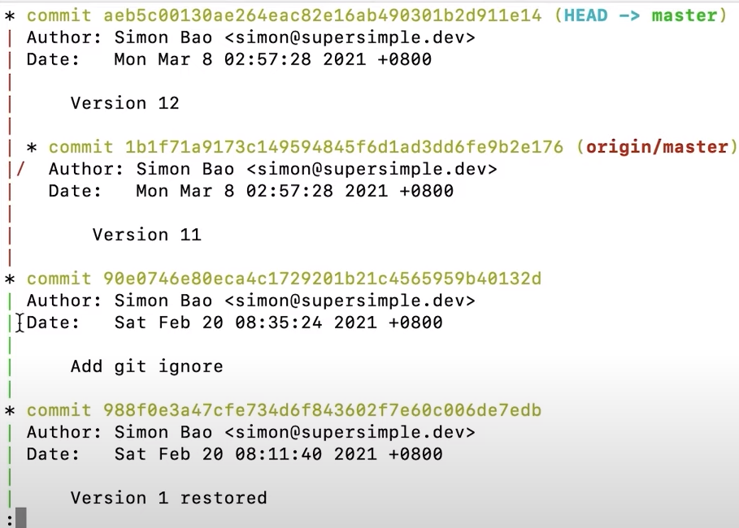
                - this is because the remote master branch has an old commit, while the local has a new branch
            * git push origin master → rejected because then we would be overriding an old commit: 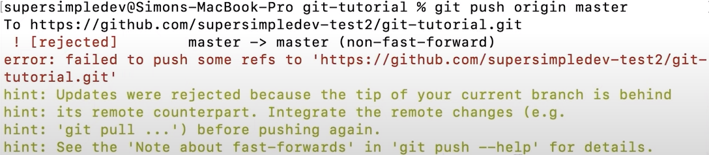
            * to get around it: git push origin master -f → force push → 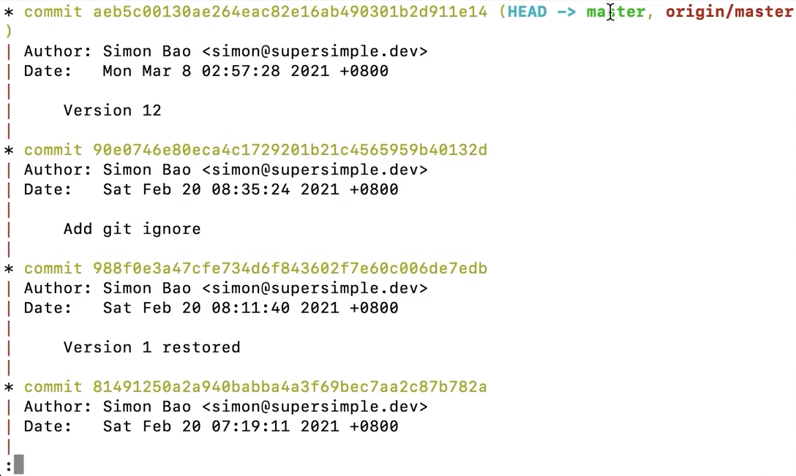
    
- Feature 3 : Sync Changes from GitHub → Computer:
    * whenever we update the remote, the local will be updated
    * go to the repos' root
    * cd ~/Deskstop
    * git clone [repo url] [folder name | default = name_of_repo]
    * 2 local repos, new and old. Updating the new won't affect the old
    * go to new: xd ~/Desktop/new-git-tutorial
    * open new in our code editor, and make some simple changes
    * run: git status
    * git add .
    * git commit -m "Version 13"
    * git push origin master → 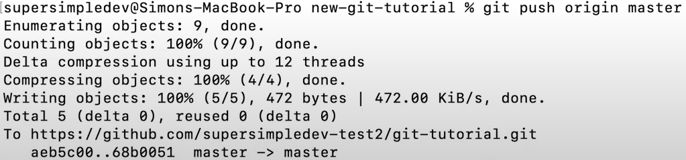
        - check by using: git log --all --graph → 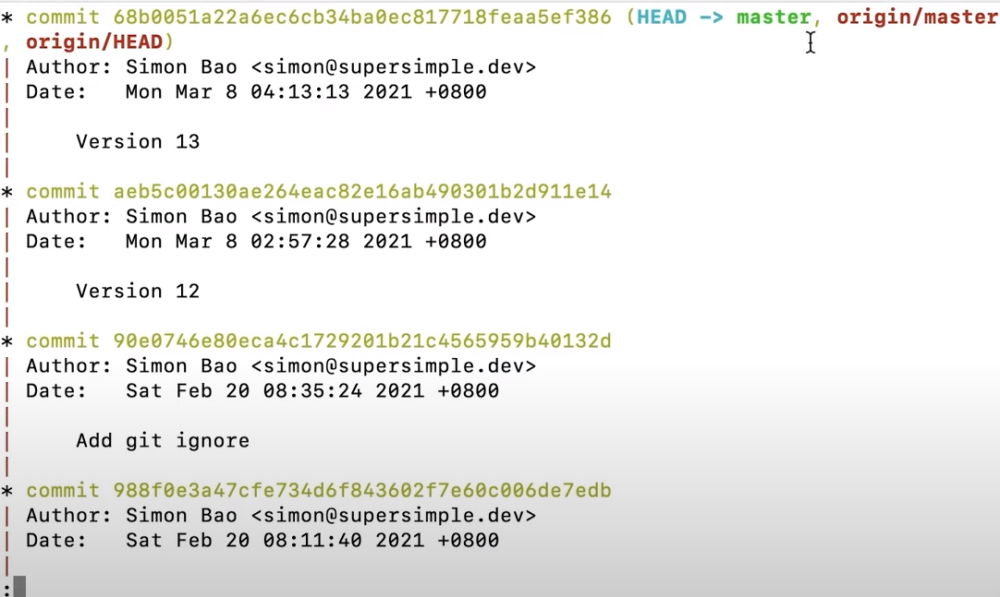
    * syncing changes to old repo:
        - go to old
        - git log --all --graph → no changes from the new copy: 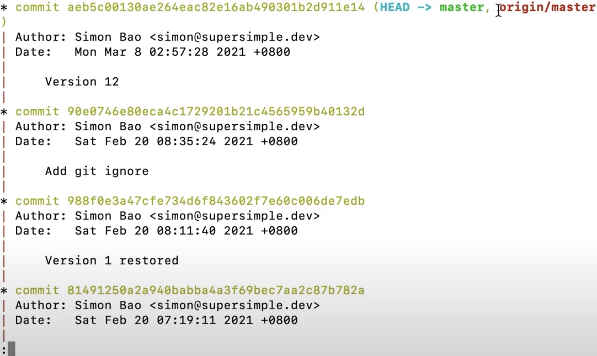
            * this is showing an incorrect log because remote tracking branches don't update automatically
            * it is reflecting the state it was in last time
        - run: git fetch → update all remote tracking branches to the current
        - run: git log --all --graph, again → 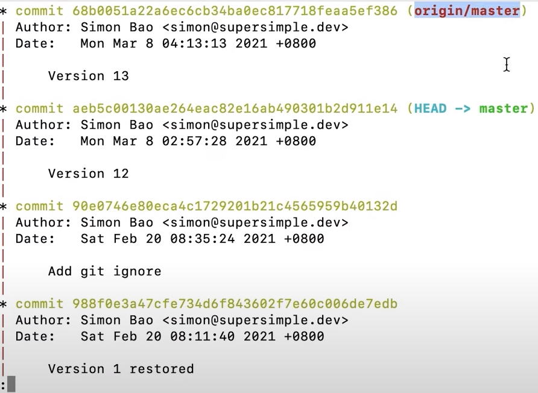
        - sync: git pull [which repo - origin] master → 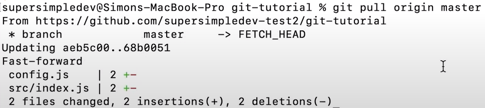
        - git log --all --graph → 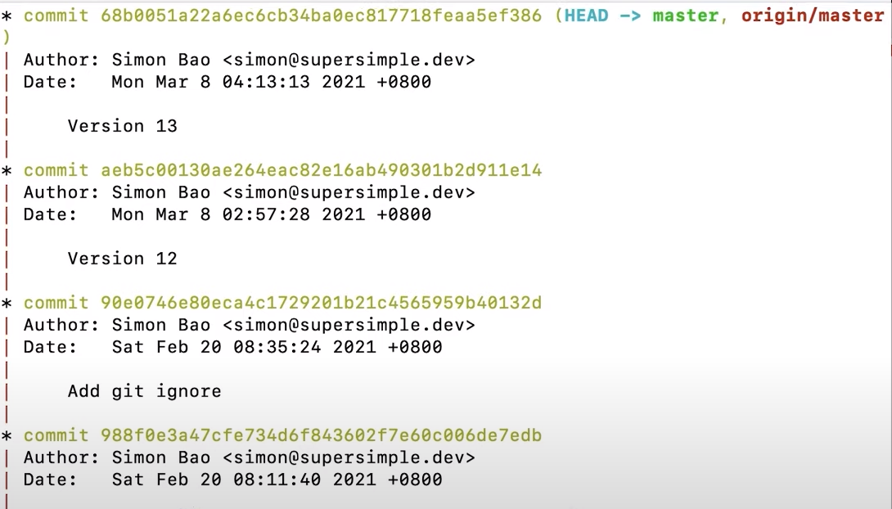
            * Shortcut: git pull origin master --set-upstream 
            * --set-upstream sets for both push and pull. It only needs to be set for one of them to work for both.