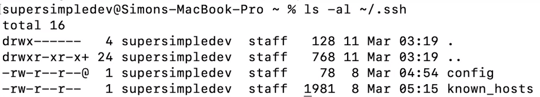
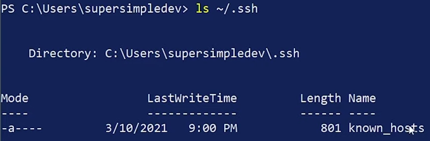
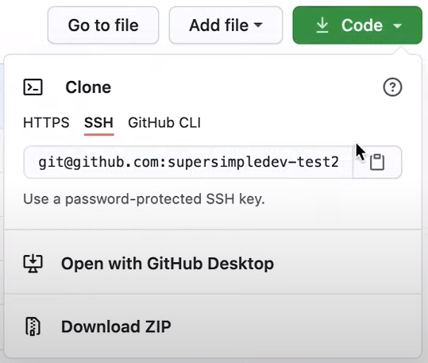
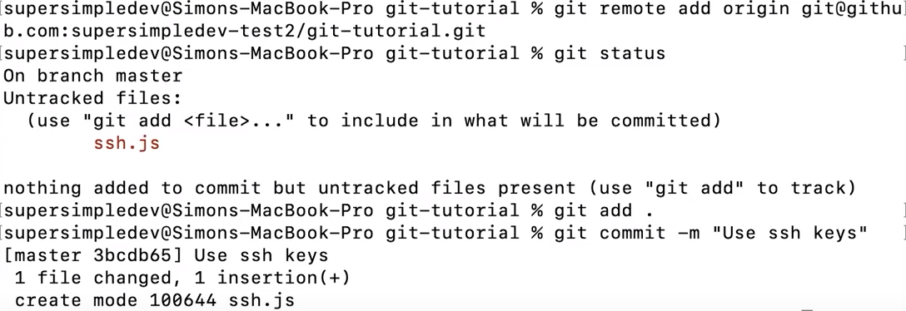

- Idea: instead of giving a password in git push, we'll make an ssh key (a file).

- Link to the GitHub Docs for adding SSH Keys: https://docs.github.com/en/authentication/connecting-to-github-with-ssh/adding-a-new-ssh-key-to-your-github-account
    * This file is pretty much a copy-paste from this docs

- Setting up SSH Keys for GitHub:
    * Mac:
        1. check if you have an existing ssh key:
            * Open termianl
            * Enter ls -al ~/.ssh → Lists the files in your ssh directory, if they exist
            * Check the direcrtory listing to see if you already have a public ssh key. By default, the filenames of the public leys are one of the following: 
                - id_rsa.pub
                - id_ecdsa.pub
                - id_ed25519.pub
            * example for not having an ssh key: 
        2. generate an SSH Key:
            * Open terminal
            * Run: $ ssh-keygen -t ed25519 -C "your_email@example.com"
                - If you're using a legacy system that does not support the ed26619 algo, use:
                    $ ssh-keygen -t rsa -b 4096 -C "your_email@example.com"
                - This creates a new ssh key. The email provided is a label
                - Looks something like: > Generating public/private ed25519 key pair. 
            * When you see "Enter a file in which to save the key", press Enter. This accepts the default file location.
            * Enter a secure password. Then verify by typing it again
        3. Adding your SSH key to the ssh-agent:
            * When adding the keys to the ssh-agent, your should *only* use the default macOS ssh-add command.
            * Start ssh agent: 
                - $ eval "$(ssh-agent -s)"
                - > Agent pid 59566
            * Add your private key to the ssh-agent: $ ssh-add -K ~/.ssh/id_ed25519
            * if you're using macOS Sierra 10.12.2 +, you'll need to modify your ~/.shh/config file (to automatically load keys into the ssh-agent and store passwords in your keychain)
                1. check to see if your config file exists in the default location:
                    - $ open ~/.ssh/config
                    - > The file /Users/*you*/.ssh/config does not exist.
                2. if the file doesn't exist, 
                    - create the file:
                        * $ touch ~/.ssh/config
                    - Open your config file, then modify it, replacing ~/.ssh/id_ed25519 if you are not using the default location and name for your id_ed25519 key.
                        - Enter into your config file:
                            - Host * 
                                - AddKeysToAgent yes
                                - UseKeychain yes
                                - IdentityFile ~/.ssh/id_ed25519
                        * if you didn't add a password, omit the 'UseKeychain' line
                3. Add your ssh private key to the ssh-agent and store your password in the keychain.
                    * If you created your key with a different name, or you're adding an existing key that has a differnet name → replace *id_ed25519* in the command with the name of your private key file.
                    * $ ssh-add -K ~/.ssh/id_ed25519
                    * Note: 
                        - '-K' is the default in Apple's ssh-add. It stores the password in your keychain. If you did not add a password then omit the -K option.
                        - if you don't have Apple's standard version installed, you may receive an error. [Lookup "Error: ssh-add: illegal option -- K"]
        4. Add the SSH key to your GitHub account:
            1. Copy the SSH public key to your clipboard (modify file name in example if needed):
                - $ pbcopy < ~/.ssh/id_ed25519.pub → Copies the contents of the file to clipboard
                - Tip: if that doesn't work. Locate the hidden .ssh folder. Open the file in a text editor, and copy to your clipboard.
            2. In the upper-right corner, click your profile picture, then go to 'Settings'
            3. click 'SSH and GPG keys'
            4. click 'New SSH key'
            5. Give it a title and paste the key from your clipboard under 'Key'
            6. Click 'Add SSH key'
    * Win: {A bit tricky because the guide is written to be used with GitBash and we're going to use PowerShell}
        1. check if you have an existing ssh key:
            * Open powershell
            * Enter ls ~/.ssh → Lists the files in your ssh directory, if they exist
            * Check the direcrtory listing to see if you already have a public ssh key. By default, the filenames of the public leys are one of the following: 
                - id_rsa.pub
                - id_ecdsa.pub
                - id_ed25519.pub
            * example for not having an ssh key: 
        2. generate an SSH Key:
            * Open terminal
            * Run: $ ssh-keygen -t ed25519 -C "your_email@example.com"
                - If you're using a legacy system that does not support the ed26619 algo, use:
                    $ ssh-keygen -t rsa -b 4096 -C "your_email@example.com"
                - Looks something like: > Generating public/private ed25519 key pair. 
            * When you see "Enter a file in which to save the key", press Enter. This accepts the default file location.
            * Enter a secure password. Then verify by typing it again
        3. Adding your SSH key to the ssh-agent:
            * If you have GitHub Desktop installed, you can use it to clone repos and not deal with SSH keys.
            * Start ssh agent:
                - Search for 'Services' in your start menu
                - Look for 'OpenSSH Authentication Agent' and open it (double click)
                - Change: Startup type: Automatic. click 'Apply' and then click 'Start'
            * Run: $ ssh-add $HOME/.ssh/id_ed25519 → added to ssh agent
        4. Add the SSH key to your GitHub account:
            1. Copy the SSH public key to your clipboard (modify file name in example if needed):
                - Run: notepad $HOME/.ssh/id_ed25519.pub
                - Copy the public key that opens up in notpad
            2. In the upper-right corner, click your profile picture, then go to 'Settings'
            3. click 'SSH and GPG keys'
            4. click 'New SSH key'
            5. Give it a title and paste the key from your clipboard under 'Key'
            6. Click 'Add SSH key'

- Using our SSH Key:
    1. Open Terminal or Git Bash and change your directory (cd)
    2. Run: git remote -v → we see that https is used
    3. Run: git remote remove origin → no more remote repo linked to our local
    4. Go to your repo in GitHub and select your SSH url: 
    5. Run: git remote add origin {GitHub SSH Url} → replace {} with actual URL
    6. Run: git push origin master → should now be able to push changes to GitHub
        - ex: 