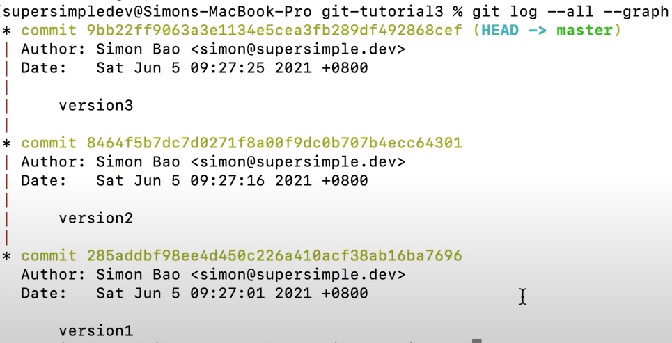
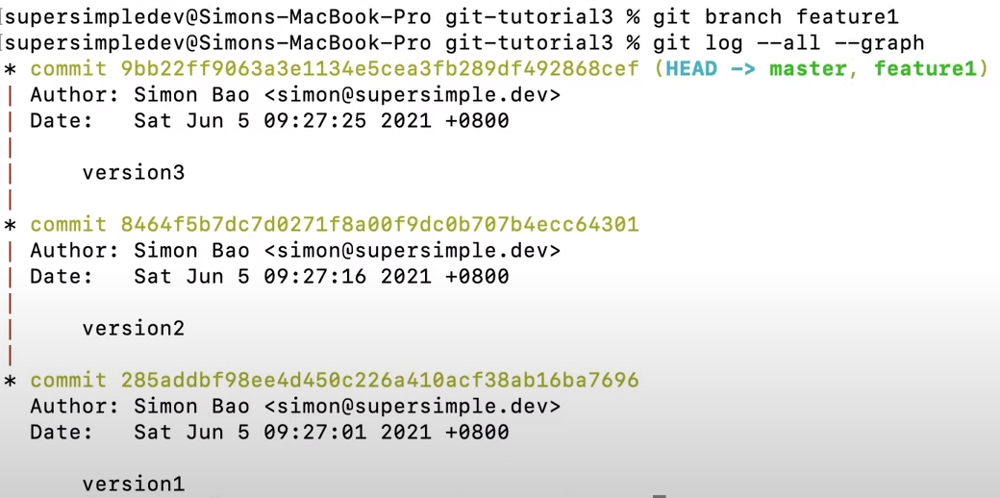
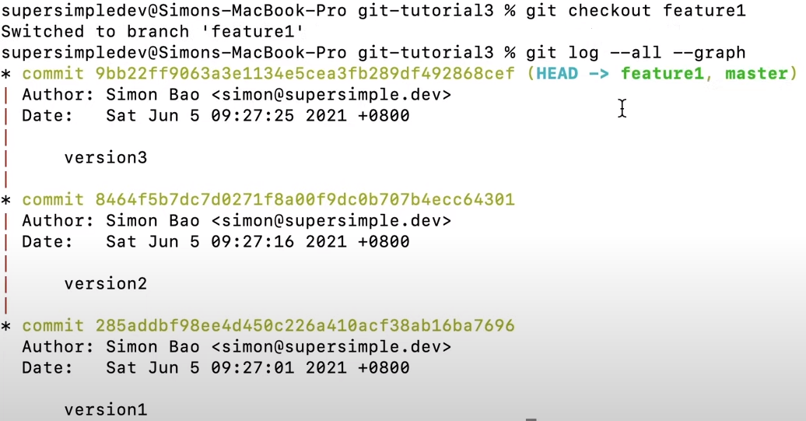
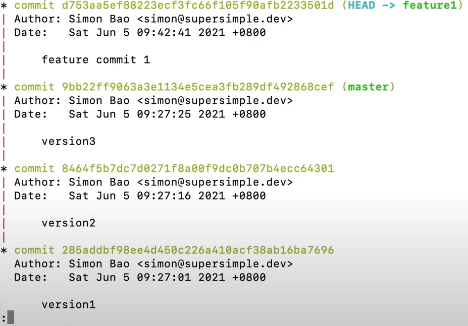
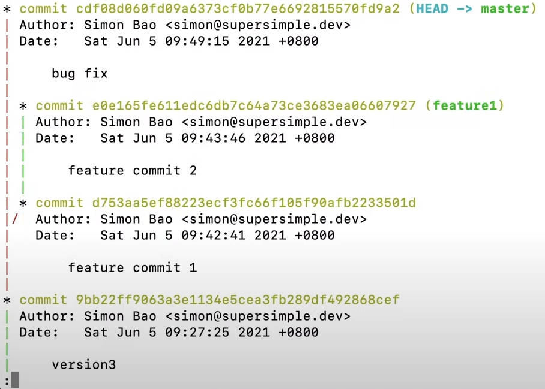

- Branching == working on multiple things at the same time

- Branching Example - 1:42 :
    * create a folder for the project. We'll refer to it as ["git-tutorial3"]
    * open your folder in the code editor
    * we'll create a version history with 3 commits in it:
        1. opent cli and cd ~/Desktop/git-tutorial3
        2. git init
        3. creating 3 commits:
            * create a file "hello" and write in it 'version1'. Then run:
                - git add .
                - git commit -m "version1"
            * edit the file to contain "version2". Then run:
                - git add .
                - git commit -m "version2"
            * edit the file to contain "version3". Then run:
                - git add .
                - git commit -m "version3"
            * Run: git log --all --graph → 
            * Now if we want to add features and fix bugs without any issues
        4. Creating a new branch:
            - git branch [name_of_branch] 
                * ex: git branch feature1 
                * git log --all --graph → 
                    - we have a master branch, and a copy called the "feature1" branch
                    - now we'll update to work on the feature1 branck
                    - the shortcut to do this: git checkout feature1
                    - then if we run: git log --all --graph, we get → 
                    - HEAD == tells use which branch we're working on
        5. Add code to feature:
            - create a new file / folders
            - commit: 
                * git add .
                * git commit -m "feature commit 1"
                * check by running: git log --all --graph. We get → 
                * we see the master branch, but we're working on the feature1 branch
        6. second commit:
            - change what you need to change in code
            - Run: 
                * git add .
                * git commit -m "feature commit 2"
                * git log --all --graph, shows that there are two commits under the feature1 branch, and the master branch was not changed
        7. moving back to master:
            - we'll do this whenever we want to fix bugs etc. (not connected to feature1)
            - git checkout master
            - git log --all --graph → (HEAD -> master), and the code we created in feature1 doesn't exist anymore
            - after adding changes to the master branch, we'll:
                * git add .
                * git commit -m "bug fix"
                * git log --all --graph → 
                * There's a branching feature