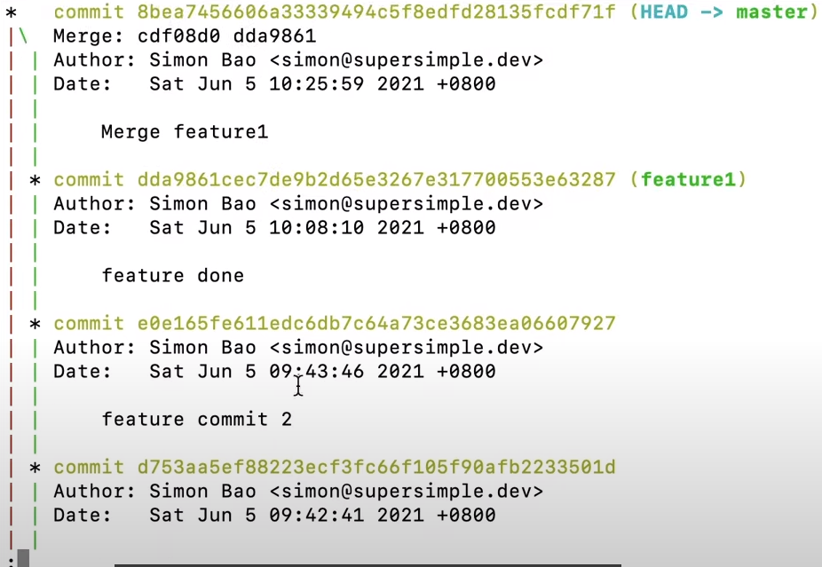
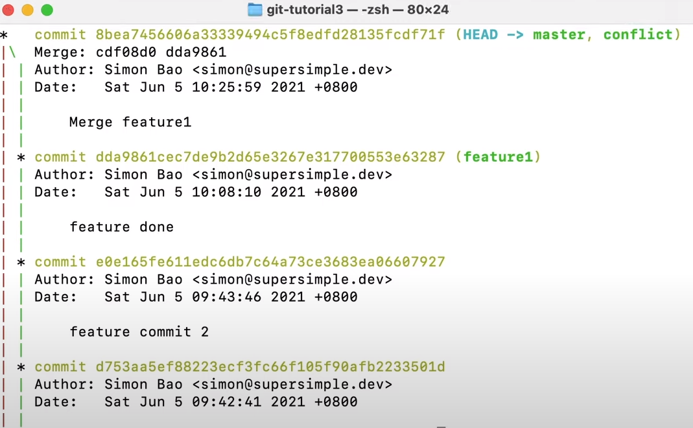
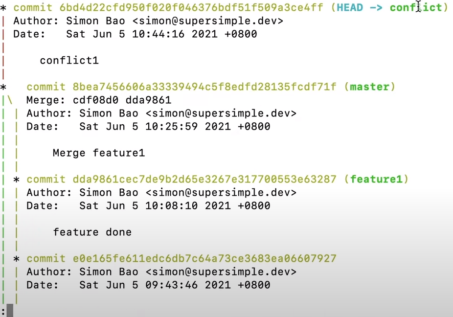
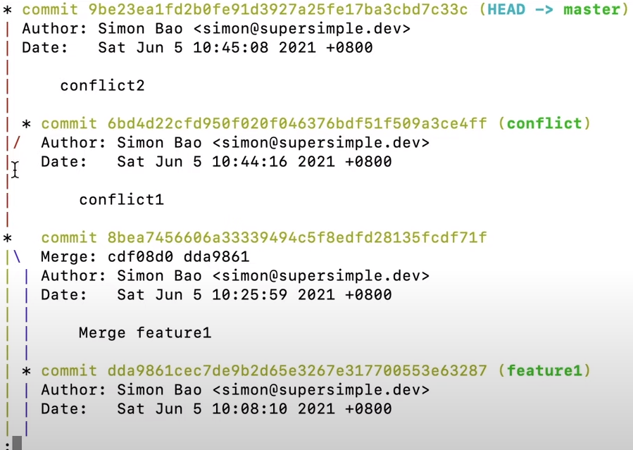
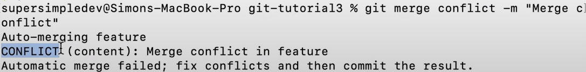
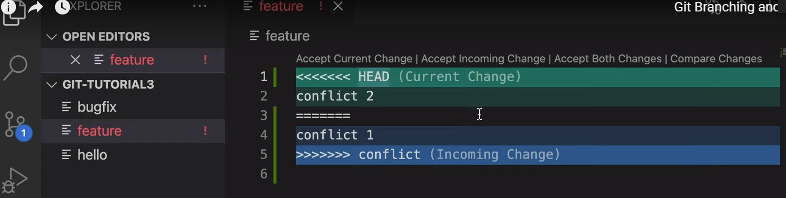
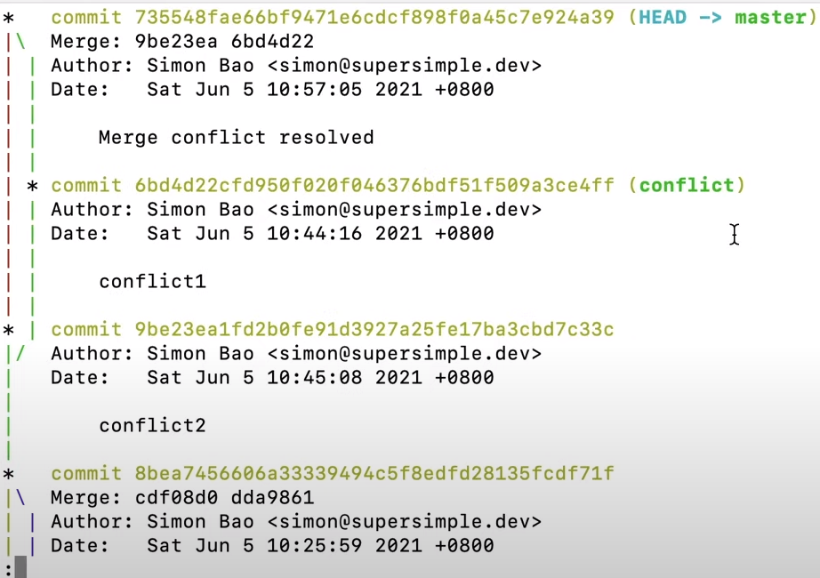

- Combining all changes together (eventually)

- Scenarios:
    * New files are added in merge
    * Changing files (different lines) → We'll contain the changes from both branches

- Continuing from our example in "1-branching":
    1. Making last commit:
        * go to the feature1 branch → git checkout feature1
        * check yourself with git log --all --graph
        * change whatever you need
        * run: 
            - git add .
            - git commit -m "feature done"
            - check yourself by running: git log --all --graph
        * Where does the result of the merge go? on top of feature1? master? somewhere else?
            - goes on to the current branch you're working on
        * Where should we put our merge result? on top of feature1? master?
            - No rules, but generally they like to use the master branch that will eventually go to the website
    2. Merging:
        * switch to master / main → git checkout master
        * check that it worked with git log
        * git merge feature1 -m "Merge feature1" → merges <branch_name> into <current_branch>
            - automated by git
            - saved in a commit
            - we'll give the message here (-m "")
            - check by running git log → 
        * the final copy has both the bug fix and feature 1

- Merge Conflicts (Git doesn't know what to do with it):
    * We don't know which one to choose.
    * git branch conflict → creating a branch named "conflict"
    * check with git log → 
    * switch to the conflict branch : git checkout conflict
    * change whatever you need to, then:
        - git add .
        - git commit -m "conflict1"
        - check yourself with git log → 
    * go back to the master branch with checkout and change the same file.
        - git add .
        - git commit -m "conflict2"
        - log to check yourself use the log command → 
    * git merge conflict -m "Merge conflict" → merge conflict into master / main
        - ex: 
        - in the code we'll see something like this → 
        - then delete whatever you don't want, or you can delete everything and write whatever you want.
        - go back to the cli and create a new commit to finish resolving the conflict:
            * git add .
            * git commit -m "Merge conflict resolved"
            * check yourself with log → 
            