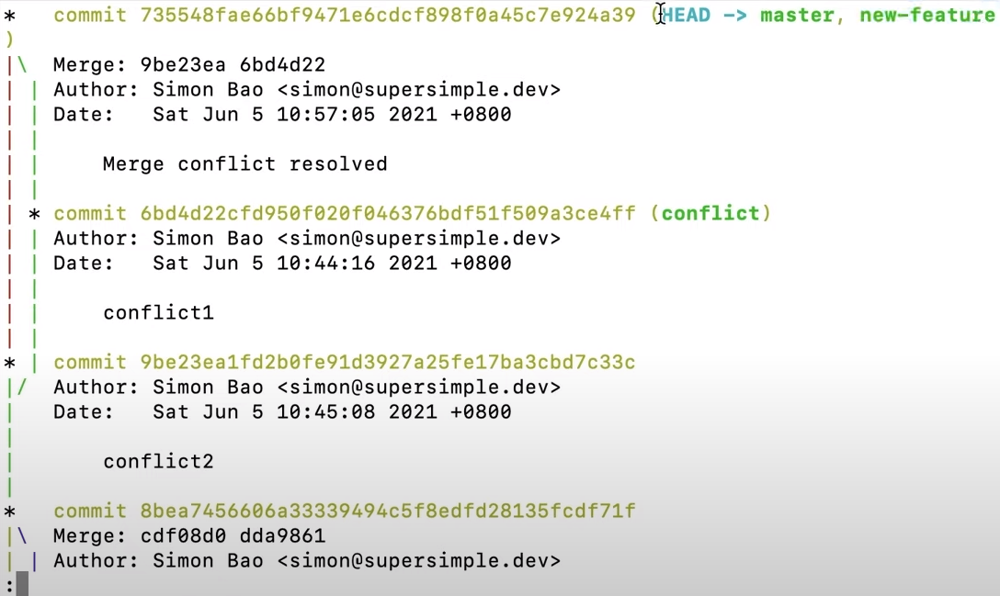
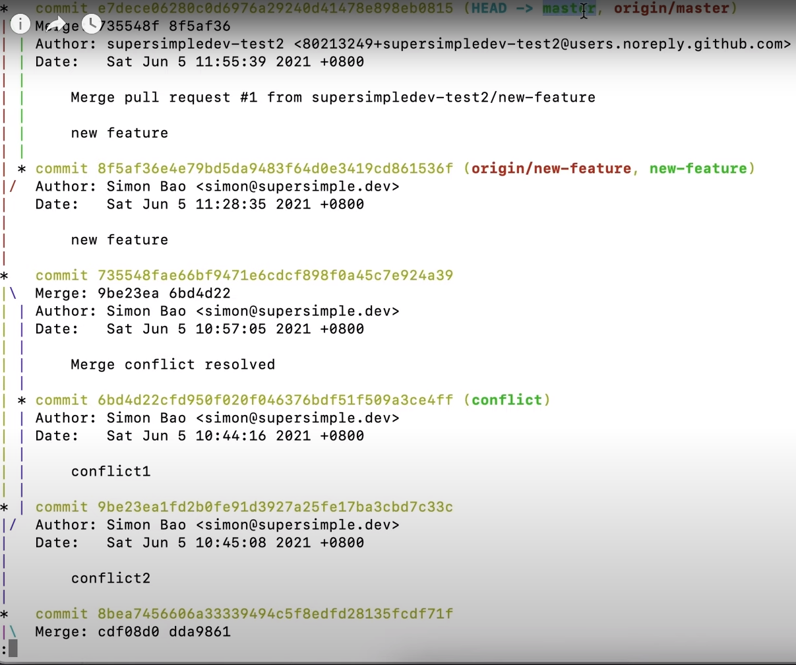
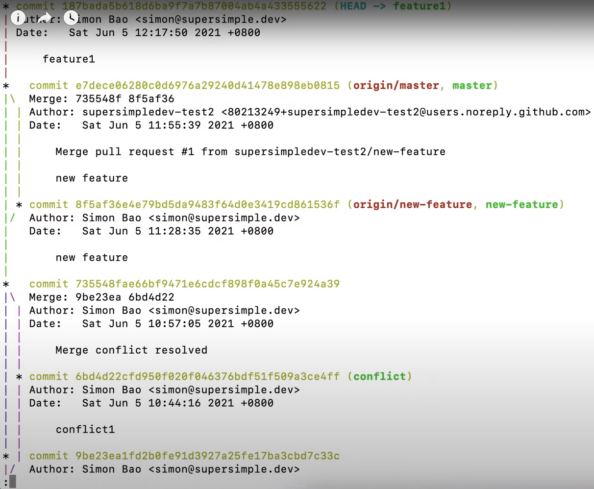
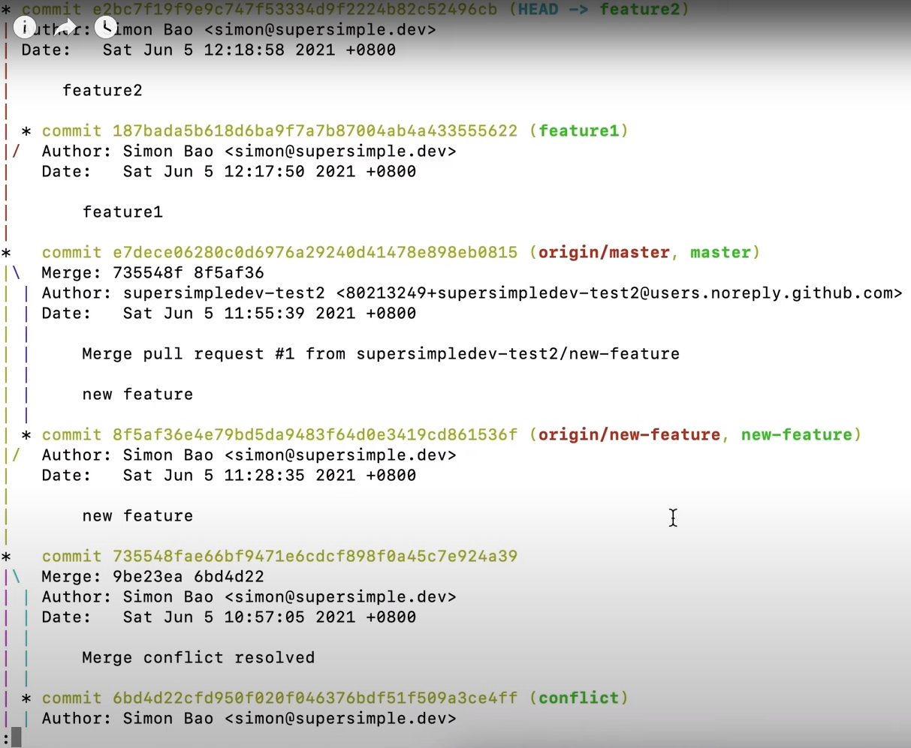
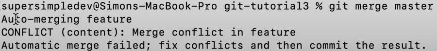

- Feature Branch Workflow → Combining everything we've learnt into a workflow :
    * What are feature branches? 
        - A workflow 
        - A step-by-step process for using Git and GitHub
    * Feature Branch Workflow: 
        1. Create a branch for a feature → Feature Branch
            - Problem: code reviews :
        2. Upload feature branch to GitHub → everyone on the team can see the code
        3. Create a "Pull Request" - (do code reviews)
        4. Merge feature branch into master / main branch (merging happens on GitHub) 
    
    * Step-by-step:
        - create a new file
        1. Create feature branch:
            - create your branch: git branch new-frature
            - run: git log --all --graph → 
            - git checkout new-feature & check yourself with git log
            - commit changes in your branch: git add . & git commit -m 'new feature'
        2. Upload to GitHub:
            - we need a github repo :
                * go to your repos
                * click new repository
                * give the same name as your file
                * take url of your repo then →
                * git remote add origin <url> → origin is the name of your repo
            - upload your master branch first then your feature branch:
                * git checkout master
                * git push origin master
                * now in github you'll have your history and master branch
            - upload feature branch:
                * git checkout new-feature
                * git push origin new-feature
            - now in github you'll be able to see your branches in the drop-down listing your branches
        3. Create Pull Request (code review)
            - Takes your feature branch, compares to master, and initiates a code review.
            - you might see this button → 
            - Manually:
                * click on your "Pull Requests" Tab
                * click "New pull request" 
                * choose "base: master" from dropdown list, and "compare: new-feature" 
                * 
                * this is the same as merging on github
                * you can add a comment as well
            - You give the url of this feature to your teammates and they can comment on bugs and such
        4. Merge feature branch:
            - click the "Merge pull request" button at the bottom → 
            - Then click the "Confirm merge" button

    * Update Local Repo After Merge:
        - git fetch → get all updates from remote repo
        - run git log to see what everything looks like:
            * 
            * locally, we have a master and a new-feature branch
            * we uploaded new-feature to origin
            * origin/new-feature → the result of uploading our local feature branch onto github
            * on github origin contains our local master and our merge
            * origin/master is ahead of our local
        - to update master:
            * git checkout master
            * git pull origin master → pull master branch from origin
            * git log --all --graph → 

- Merge Conflicts in Feature Branch Workflow :
    * Scenario:
        - 2 people create 2 branches
        - both change the same file in the same line
        - 1 merges with master and it works
        - the second can't merge because of a merge conflict
    * Example:
        - start off in master
        - create 2 branches:
            1. feature 1
                - git branch -D feature1 → delete previous feature1 branch (that we created previously)
                - git branch feature1 → create feature1 branch (created beside master)
                - check with git log
                - make changes
                - commit with:
                    * git checkout feature1
                    * git commit -m "feature1"
                    * check with git log → 
            2. feature 2
                - git checkout master
                - git branch feature2
                - git checkout branch2
                - make changes
                - commit:
                    * git add .
                    * git commit -m "feature2"
                    * check work with git log → 
        - upload both to github:
            * git push origin feature2
            * git checkout feature1
            * git push origin feature1
        - Merging → Creating Conflict (on github)
            * go to pull requests on github
            * create pull req
            * make sure we have: "base: master" ← "compare: feature1"
            * create a pull req with feature2
            * make sure we have: "base: master" ← "compare: feature2"
            * we now have 2 branches that want to be merged
            * let's say feature1 is merged
            * we go now to feature2 and we have a merge conflict
            * you can use your web editor to resolve it (on github)
            * click "Mark as Resolved" and then "Commit merge"
            * click "Merge pull request"
        - Resolve Merge Conflicts on our Computer :
            * Set up required:
                - same scenario as before
                - git checkout master, git pull origin master
                - create 2 branches that modify the samee file, same line
                - push to GitHub & create pull request
                - name them feature3 & featrue4
            * Merge:
                - first merge feature3 into master
                - go to feature4 in github (we have a conflict)
            * On our computer:
                - We just merged the feature3 branch on GitHub so we must git pull again:
                    * git checkout master
                    * git pull origin master
                    * git checkout feature4
                - merge master into feature branch
                    * merge merges into current branch
                    * git merge master → 
                - go to your code editor and choose what you want to keep
                - Resolve conflict:
                    * git add . → add changes
                    * git commit -m "Conflict resolved"
                    * git push origin feature4
                - Now in github we'll see that the conflict was resolved