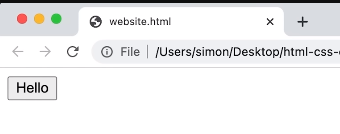
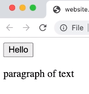

- What is HTML? 
    * Hyper Text Markup Language
    * It's a tool we use to create websites
    * html gives our computer step-by-step instructions

- Images:
    1. 
    2. 

- Notes:
    * <___>....</___> → HTML Element
    * <___> → <> → HTML Tag & '___' → tag name
    * <___> → opening tag, </___> → closing tag
    * Syntax ↔ Rules of writing code ↔ grammar (for code)
    * <___ ###=...> → HTML Attribute (###) → modifies how an element behave, ### → attribute name
    * extra spaces are ignored in html
    * extra new lines are also ignored in html
    * we usually use 2 spaces as tab instead of the default 4