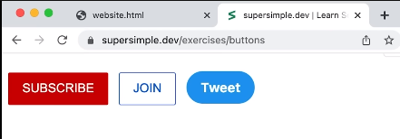

- CSS ↔ Cascading Style Sheets

- What we'll create:
    1. 
    2. 

- Definitions:
    * ---- { ___; ___; }
        - ---- → CSS Selector == which elements we're targeting
        - ___; → CSS Property
    * color (property) == text color
    * color selecion:
        - name of color
        - rgb(_,_,_):
            * each parameter ranges from 0 to 255
            * format is: red, green, blue
            * red == rgb(255, 0, 0)
            * green == rgb(0, 255, 0)
            * blue == rgb(0, 0, 255)
    * class (html attribute):
        - let's us choose a specific html element 
        - used when we have multiple occurrances of the same html element,
        and want them all to look different

- General Technique:
    1. Create button with html
    2. Style with css one-by-one

- Tip: If you don't know a css property, look it up, there're many explanations