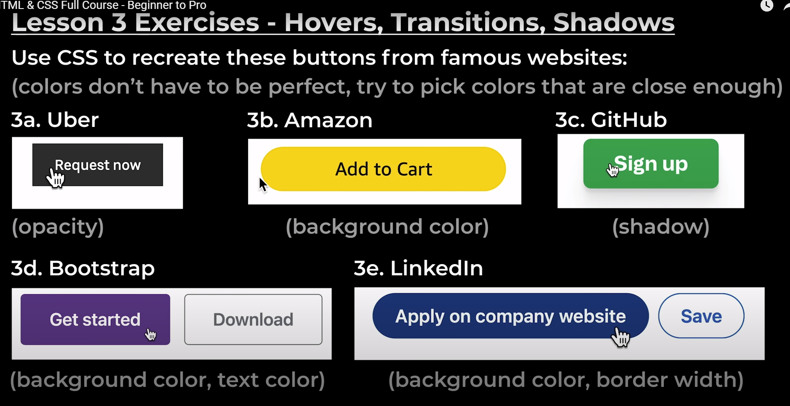
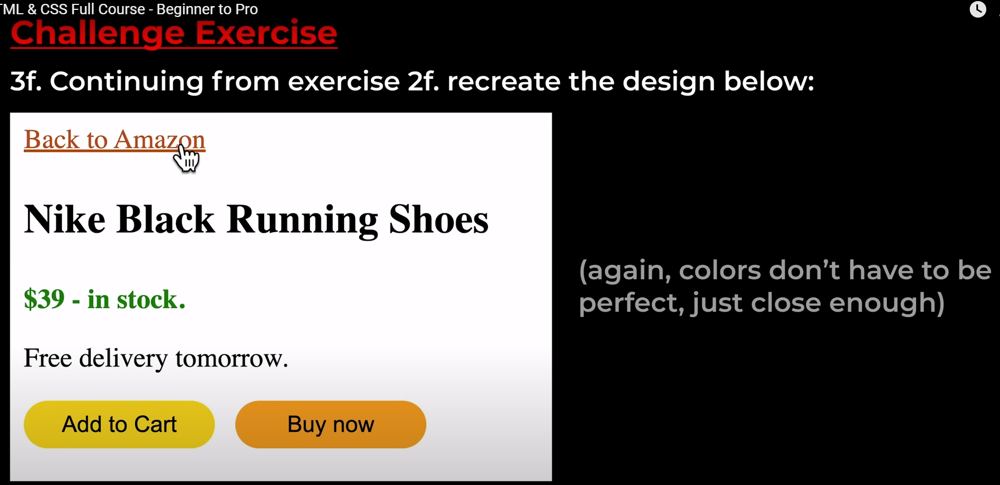

- definitions:
    * box-shadow: right (horazontal), down (vertical), blur, shadow color
    * transition: background-color 1s, color 1s;
    * rgba(r, g, b, a) → a is [0 → 1] (transparency)

- Exercises: 
    1. 
    2. 