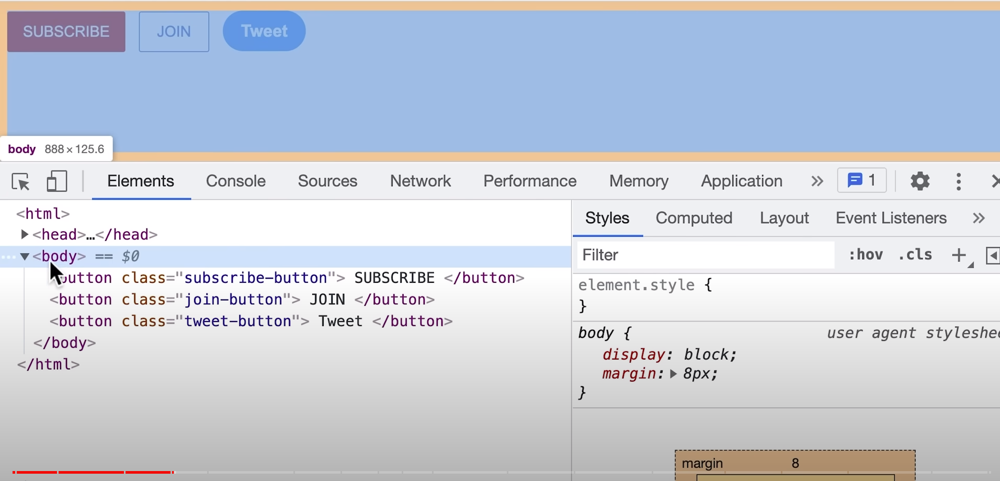
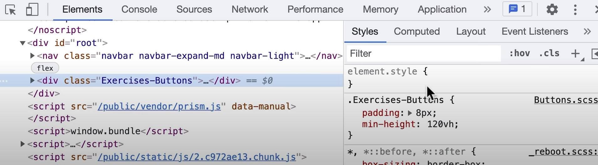
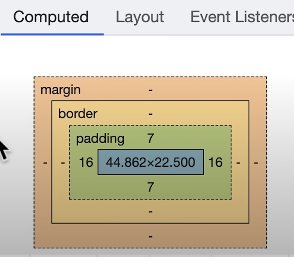

- Google Dev Tools:
    * They will help us get the perfect measurments and/or colors etc.
    * steps:
        1. right click on your webpage and click "inspect"
            - We now see all the html on the page: 
                
            - Using this, we can visualize it all. 
            - As well as the styles: 
                
            - By clicking on the pointer icon: 
                , 
                you can click on a specific html element. 
                This will show you all the information on that specific element.
                Such as the html tag and css styling.
        2. click on "computed" → 
            
            this will show the final styles applied to the html element we selected.
            We can find the width, color etc.

- CSS Box Model:
    * allows us to add spaces between elements and inside them
    * around elemetns → margin (space outside element)

- Definitions:
    * Hex: #RRGGBB → another way to show colors

