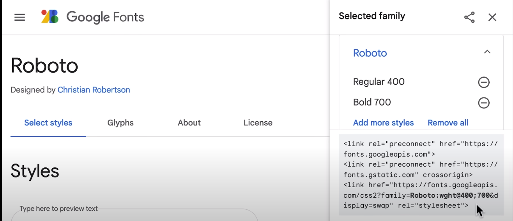

- notes:
    * <!DOCTYPE html> → tells the browser to use a modern version of html
    * only one <html> element → the web page
    * nesting is part of the HTML syntax
    * <body> → contains all elements that are visible
    * <head> → elements not visible on the page
    * <title> → shows up on the tab but not on the page
    * a feature => we have different files for styles, html elements (and javascript, but that comes much later)
    * <link> → void element
    * void elements → don't need a closing tag
    * href attribute → directory path. Looks at files right next to the file where this property is being used in.
    * Features we get from following the HTML structure:
        1. <title>
        2. Live Server
        3. Link CSS files
        4. Add new fonts and more.

- loading fonts:
    1. search google fonts
    2. search for a font you like
    3. pick the font and the styles you want
    4. click "select this style" at the bottom of the screen
    5. copy the <link> tags provided provided for the font
    6. paste it into your head section
    7. example: 
