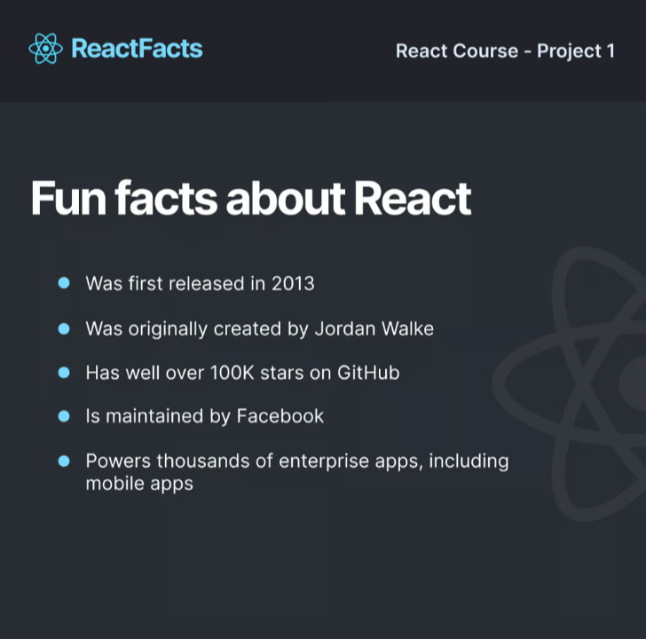
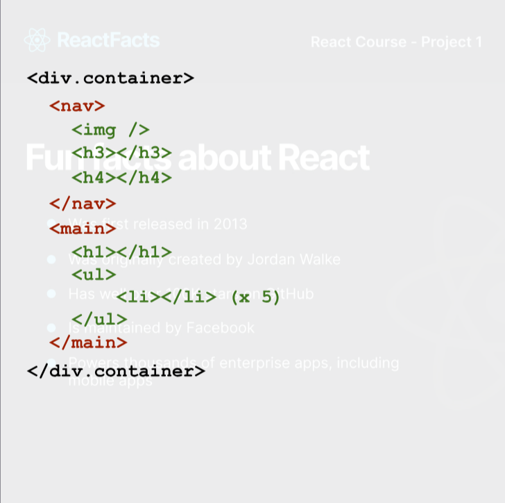

- Layout:

# The Site
The site is a single page application built with the following components:
1. Header component (contains logo next to the text "ReactFacts" and the project title - "React Course - Project 1").
    elements: flex-box, margin: auto - for text
2. Main content area (contains title - "Fun facts about React" and a list of facts).

- Element Layout:
    
    * 2 custom components: nav and main, surrounded by a parent custom component